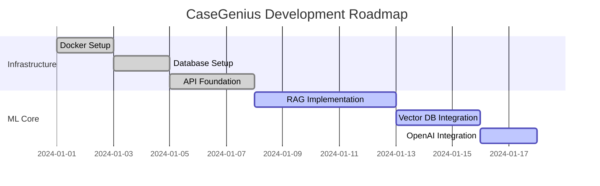
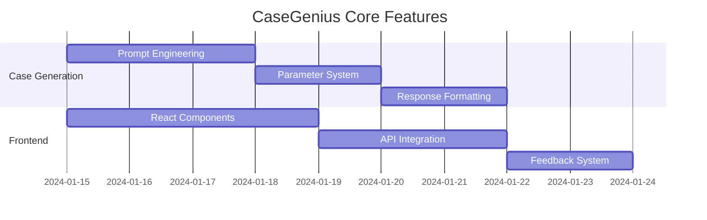
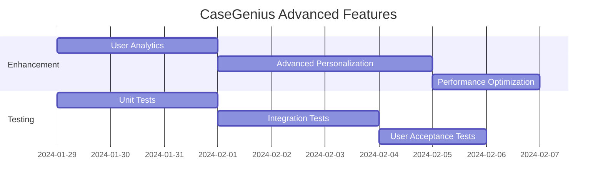

## Практическая работа №1 - CaseGenius

### 1.2.1. Назначение системы CaseGenius

**CaseGenius** — веб-платформа для генерации персонализированных управленческих кейсов с использованием RAG-архитектуры.

**Назначение системы:**
Автоматизация и персонализация процесса создания и решения управленческих кейсов для развития бизнес-компетенций студентов, преподавателей и корпоративных тренеров. Система решает проблему недостатка качественных, персонализированных учебных материалов в области управленческого образования, обеспечивая создание реалистичных бизнес-ситуаций на основе академических источников с автоматизированной обратной связью.

**Основные задачи системы:**
- Генерация персонализированных управленческих кейсов на основе компетенций и уровня пользователя
- Предоставление автоматизированной обратной связи на решения кейсов
- Адаптация сложности и содержания кейсов под конкретные потребности пользователей
- Интеграция академических знаний с практическими бизнес-ситуациями через RAG-технологии

### 1.2.2. User Story для системы CaseGenius

| **Кто?** | **Что хочет?** | **С какой целью?** |
|---|---|---|
| Студент MBA | Сгенерировать кейс по стратегическому менеджменту | Подготовиться к экзамену и развить навыки стратегического мышления |
| Корпоративный тренер | Создать кейс по управлению изменениями для команды | Провести эффективное обучение сотрудников |
| Преподаватель университета | Получить кейс с автоматической обратной связью | Сэкономить время на проверке решений студентов |
| Студент | Получить персонализированную обратную связь на свое решение | Понять свои сильные и слабые стороны в решении кейсов |
| HR-менеджер | Создать кейс для оценки кандидатов на управленческую позицию | Провести объективную оценку управленческих компетенций |
| Консультант | Получить кейс по конкретной отрасли (IT, финансы) | Подготовиться к работе с клиентом в новой отрасли |
| Менеджер проекта | Решить кейс по управлению рисками | Развить навыки управления проектами |
| Начинающий руководитель | Получить кейс с адаптированной сложностью | Постепенно развивать управленческие навыки |
| Академический исследователь | Получить доступ к источникам, использованным в кейсе | Провести научное исследование на основе кейсов |
| Администратор системы | Управлять пользователями и их компетенциями | Обеспечить корректную персонализацию кейсов |

### 1.2.3. Функциональные требования

| **Кто?** | **Что хочет?** | **С какой целью?** | **Функциональное требование** |
|---|---|---|---|
| Студент MBA | Сгенерировать кейс по стратегическому менеджменту | Подготовиться к экзамену и развить навыки стратегического мышления | Система должна предоставлять форму выбора компетенции с выпадающим списком (стратегическое мышление, лидерство, управление изменениями и т.д.).  Система должна автоматически определять уровень сложности на основе профиля пользователя.  Система должна генерировать кейс длиной 500-1000 слов с четкой постановкой задачи. |
| Корпоративный тренер | Создать кейс по управлению изменениями для команды | Провести эффективное обучение сотрудников | Система должна позволять выбирать целевую аудиторию (уровень менеджмента, опыт работы).  Система должна генерировать кейс с учетом корпоративного контекста и отрасли.  Система должна предоставлять методические рекомендации для проведения кейса. |
| Преподаватель университета | Получить кейс с автоматической обратной связью | Сэкономить время на проверке решений студентов | Система должна генерировать кейс с заранее определенными критериями оценки.  Система должна автоматически анализировать текстовые ответы студентов.  Система должна предоставлять детальную обратную связь с указанием сильных и слабых сторон. |
| Студент | Получить персонализированную обратную связь на свое решение | Понять свои сильные и слабые стороны в решении кейсов | Система должна анализировать решение пользователя с помощью NLP.  Система должна сравнивать решение с эталонными ответами.  Система должна предоставлять рекомендации по улучшению с конкретными примерами. |
| HR-менеджер | Создать кейс для оценки кандидатов на управленческую позицию | Провести объективную оценку управленческих компетенций | Система должна генерировать кейс с четкими критериями оценки.  Система должна предоставлять шкалу оценки от 1 до 5 по каждой компетенции.  Система должна сохранять результаты оценки для последующего анализа. |
| Консультант | Получить кейс по конкретной отрасли (IT, финансы) | Подготовиться к работе с клиентом в новой отрасли | Система должна предоставлять фильтр по отраслям (IT, финансы, здравоохранение, производство).  Система должна генерировать кейс с отраслевой спецификой и терминологией.  Система должна предоставлять справочную информацию по отрасли. |
| Менеджер проекта | Решить кейс по управлению рисками | Развить навыки управления проектами | Система должна генерировать кейс с описанием проекта и выявленными рисками.  Система должна требовать от пользователя предложить план управления рисками.  Система должна оценивать полноту и реалистичность предложенного плана. |
| Начинающий руководитель | Получить кейс с адаптированной сложностью | Постепенно развивать управленческие навыки | Система должна адаптировать сложность кейса на основе предыдущих результатов пользователя.  Система должна предоставлять подсказки и дополнительные материалы для начинающих.  Система должна отслеживать прогресс пользователя и предлагать более сложные кейсы. |
| Академический исследователь | Получить доступ к источникам, использованным в кейсе | Провести научное исследование на основе кейсов | Система должна предоставлять список источников, использованных для генерации кейса.  Система должна предоставлять прямые ссылки на академические статьи и книги.  Система должна сохранять историю всех использованных источников. |
| Администратор системы | Управлять пользователями и их компетенциями | Обеспечить корректную персонализацию кейсов | Система должна предоставлять панель администратора с управлением пользователями.  Система должна позволять редактировать профили компетенций пользователей.  Система должна предоставлять аналитику использования системы и качества кейсов. |

### 1.2.4. План реализации проекта

**Команда проекта:** Дорохов Даниил, Мария Николаева

#### Роли в проекте:
- **Tech Lead & Backend Developer** (Дорохов Даниил)
- **ML Engineer & Frontend Developer** (Мария Николаева)

#### Спринт 1 (Неделя 1): Базовая инфраструктура
**Роль:** Tech Lead & Backend Developer
- [ ] Настройка Docker окружения
- [ ] Развертывание PostgreSQL + Qdrant
- [ ] Базовая FastAPI структура
- [ ] Система аутентификации

#### Спринт 2 (Неделя 2): RAG ядро
**Роль:** ML Engineer & Frontend Developer
- [ ] Импорт и обработка PDF в векторную БД
- [ ] Реализация поиска по эмбеддингам
- [ ] Интеграция с OpenAI API
- [ ] Тестирование качества ретривера

#### Спринт 3 (Неделя 3): Генерация кейсов
**Роль:** Tech Lead & Backend Developer
- [ ] Промпт-инжиниринг для кейсов
- [ ] Система параметров генерации
- [ ] Форматирование ответов
- [ ] Тестирование на 20+ примерах

#### Спринт 4 (Неделя 4): Интерфейс и интеграция
**Роль:** ML Engineer & Frontend Developer
- [ ] React фронтенд с базовыми формами
- [ ] Интеграция бэкенд-фронтенд
- [ ] Система обратной связи
- [ ] Деплой и тестовый запуск

---

## 🗺️ Roadmap CaseGenius

### Phase 1: Foundation (Week 1-2)

### Phase 2: Core Features (Week 3-4)

### Phase 3: Advanced Features (Week 5-8)
