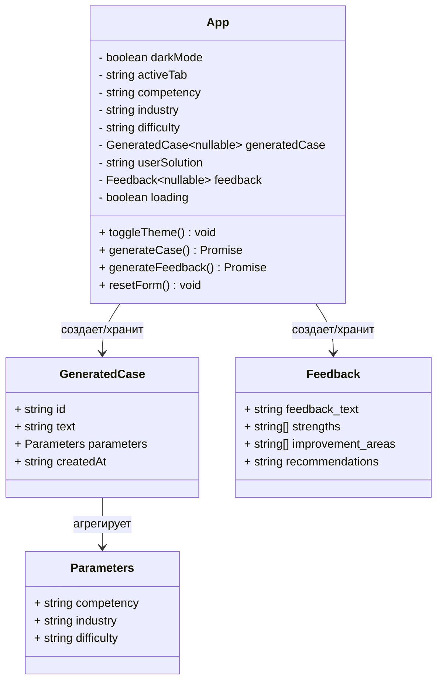
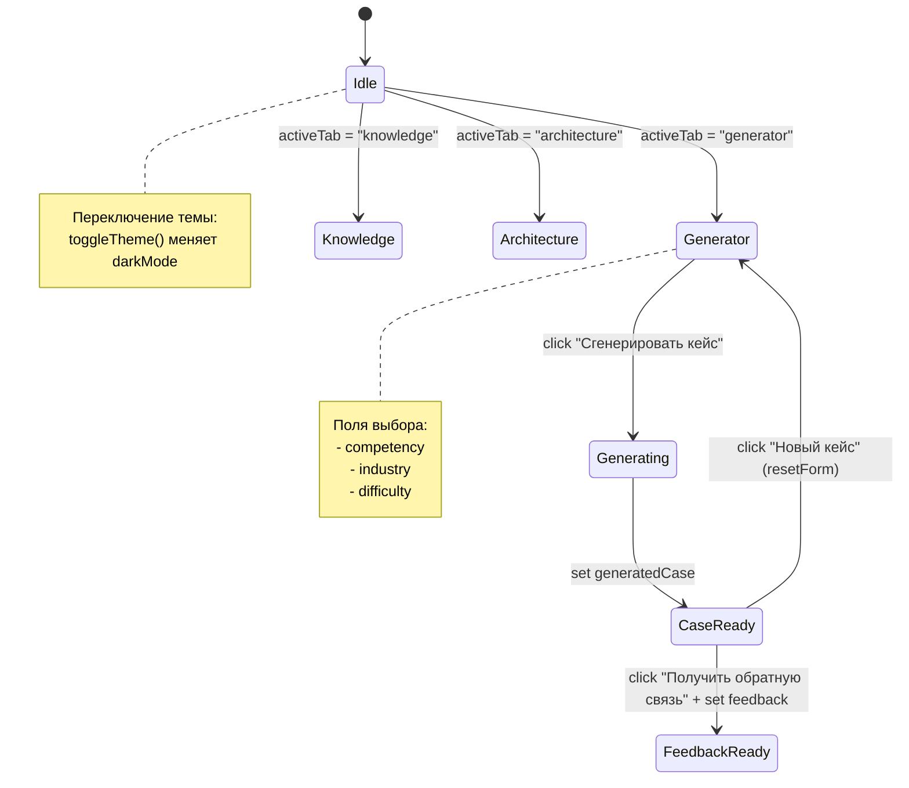
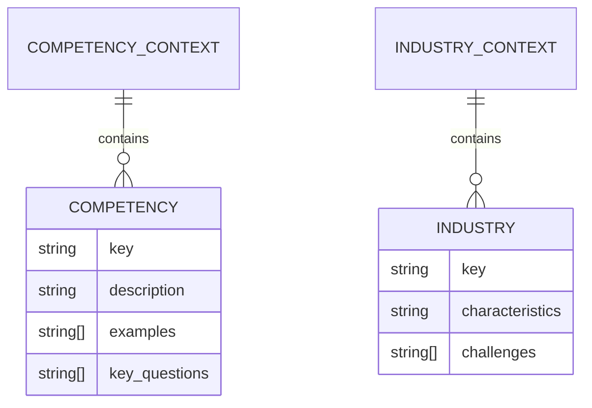

# ПРАКТИЧЕСКАЯ РАБОТА №2

Ниже представлены UML-диаграммы в формате Mermaid, которые корректно рендерятся в GitHub. Диаграммы отражают ключевые аспекты архитектуры и поведения фронтенд-приложения (React + Vite + Tailwind).

## 1) Component Diagram — верхнеуровневая структура

```mermaid
flowchart TB
  subgraph Browser[Браузер]
    UI[React UI (компонент App)]
  end

  subgraph Build[Vite/Tailwind]
    Vite[Vite dev/build]
    TW[Tailwind CSS]
  end

  indexHTML[index.html]\n ->|mount| UI
  UI -->|импорт| main.jsx
  main.jsx -->|рендерит| App.jsx

  Vite -->|собирает| index.html
  Vite -->|бандлит| main.jsx
  Vite -->|бандлит| App.jsx
  TW -->|генерирует стили| UI
```

Ключевые файлы: `src/main.jsx`, `src/App.jsx`, `index.html`, `vite.config.js`, `tailwind.config.cjs`.

## 2) Class Diagram — основные сущности состояния в App



Основано на хуках состояния и структурах данных внутри `App.jsx`.

## 3) State Machine — вкладки и режимы UI



Отражает переходы между вкладками и под-состояниями генератора.

## 4) Sequence Diagram — генерация кейса и получение обратной связи

```mermaid
sequenceDiagram
  participant U as User
  participant A as App (React)
  participant T as Timer/Mock API

  U->>A: Нажимает "Сгенерировать кейс"
  A->>A: set loading=true
  A->>T: setTimeout(2000)
  T-->>A: resolve с mockCases
  A->>A: set generatedCase; set loading=false

  U->>A: Вводит решение и жмет "Получить обратную связь"
  A->>A: set loading=true
  A->>T: setTimeout(1500)
  T-->>A: resolve с mockFeedback
  A->>A: set feedback; set loading=false
```

Отражает асинхронный сценарий без реального бэкенда (mock через `setTimeout`).

## 5) Data Contexts — знания компетенций и отраслей



Соответствует константам `COMPETENCY_CONTEXT` и `INDUSTRY_CONTEXT` в `App.jsx`.

---

Краткие ссылки на артефакты:
- `src/App.jsx` — логика состояния, UI, генерация/фидбек
- `src/main.jsx` — монтирование React-приложения
- `index.html` — контейнер корня и подключение бандла
- `package.json` — скрипты `dev/build/preview`, деплой на GitHub Pages
