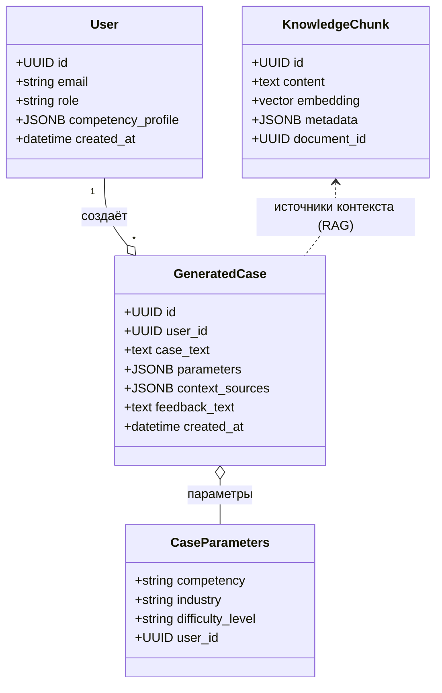
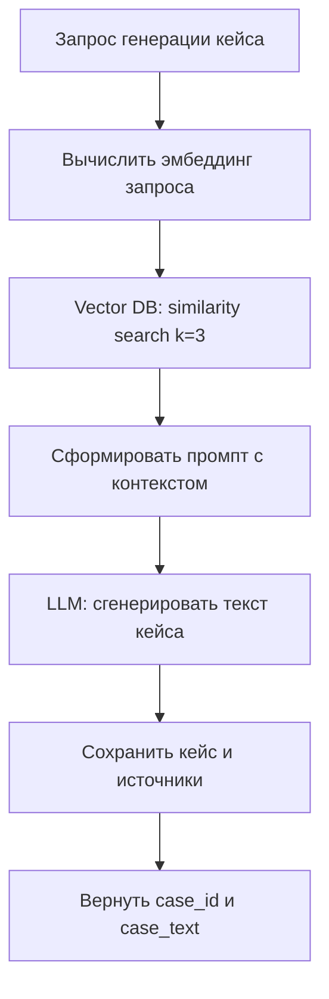
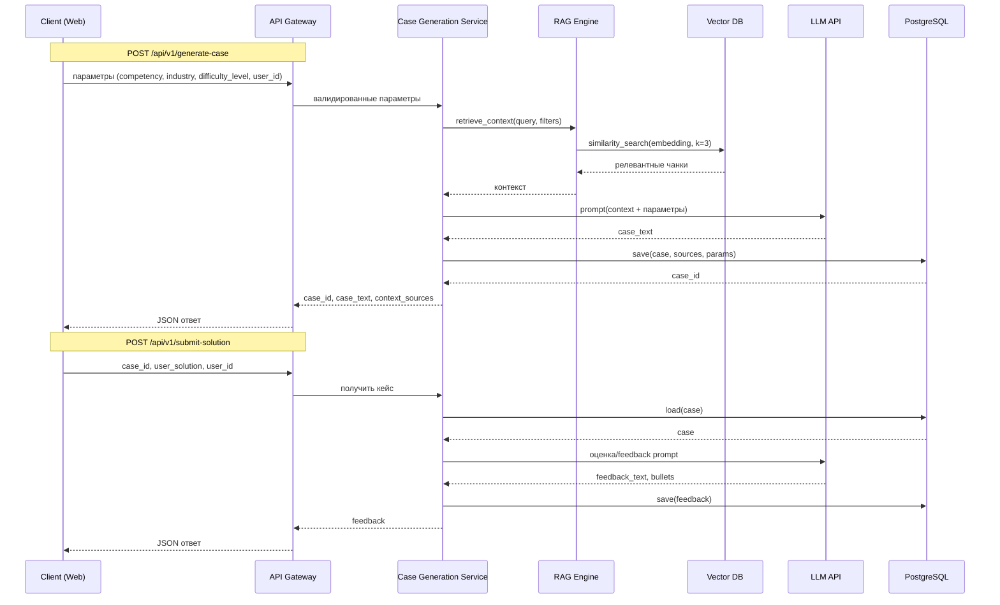
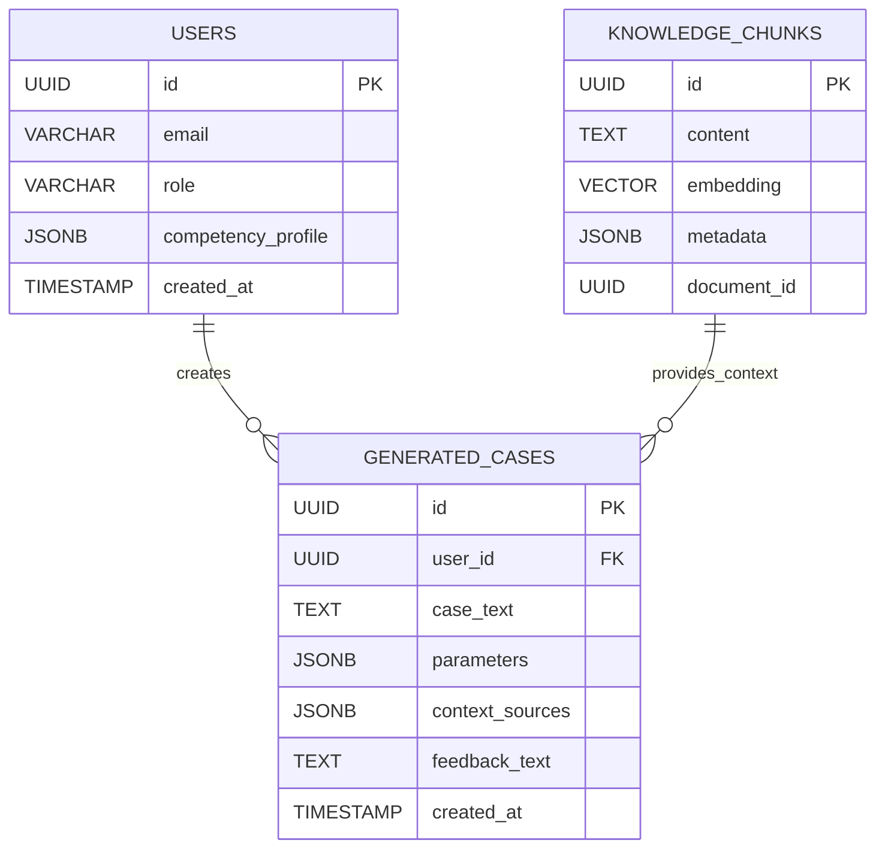

# ПРАКТИЧЕСКАЯ РАБОТА №2

Ниже представлены UML-диаграммы в формате Mermaid, которые корректно рендерятся в GitHub. Диаграммы отражают архитектуру и поведение теоретического проекта CaseGenius (RAG-платформа для генерации управленческих кейсов).

## 1) System Component Diagram — верхнеуровневая архитектура CaseGenius

```mermaid
flowchart TB
  A[Клиент (Web/React)] --> B[API Gateway]
  B --> C[Auth Service]
  B --> D[Case Generation Service]
  B --> E[Feedback Service]

  D --> F[RAG Engine]
  F --> G[Vector DB]
  F --> H[LLM API]

  E --> H
  E --> I[Evaluation Logic]

  G --> J[Knowledge Base]
  D --> K[(PostgreSQL: User Profiles)]
  E --> K

  classDef cloud fill:#e8f5e9,stroke:#2e7d32,color:#1b5e20;
  classDef data fill:#ede7f6,stroke:#5e35b1,color:#311b92;
  class H cloud;
  class G,J,K data;
```

## 2) Domain Model (Class Diagram) — ключевые сущности



## 3) RAG Pipeline (Activity) — поток операций



## 4) Sequence Diagram — API сценарии



## 5) Data Model (ER) — основные таблицы



---

Краткие примечания:
- Диаграммы отражают теоретическую архитектуру MVP «CaseGenius» (RAG + LLM).
- Диаграммы совместимы с рендером Mermaid на GitHub (без управляющих символов и составных инструкций на одной строке).
