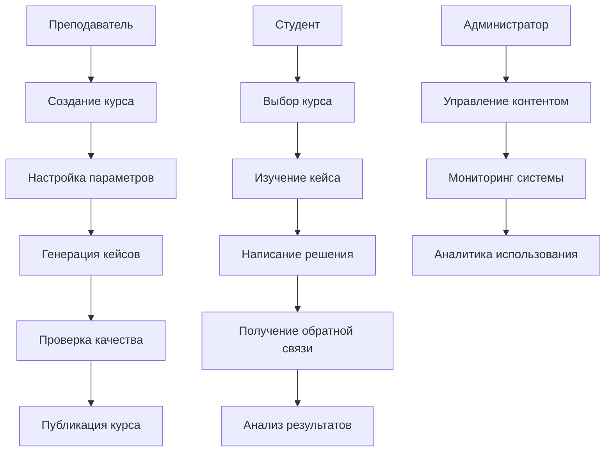
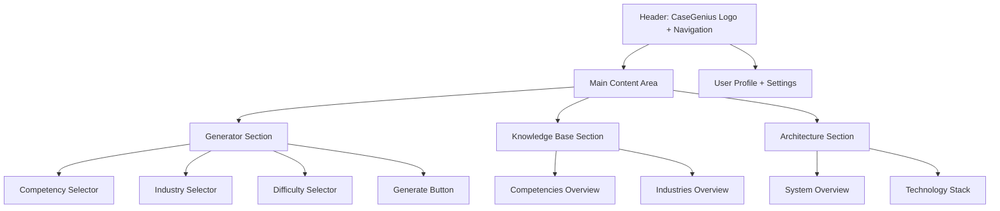
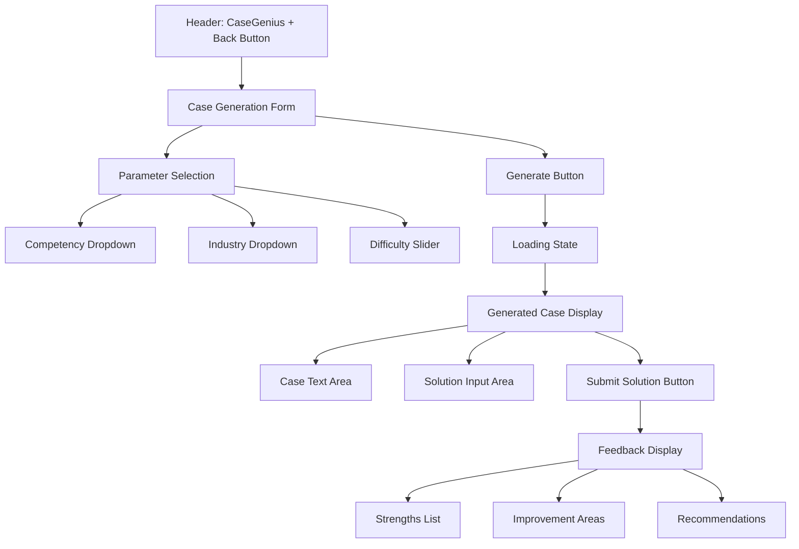
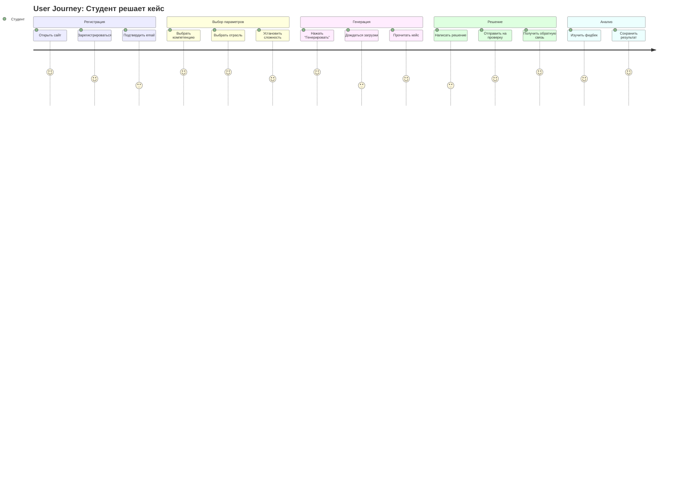

# ПРАКТИЧЕСКАЯ РАБОТА №3
## Основы системного проектирования ИС

**Тема:** Разработка бизнес-требований, пользовательских требований и спецификаций для системы CaseGenius

---

## 1. Бизнес-требования для системы CaseGenius

### 1.1. Общая характеристика проекта

**Наименование системы:** CaseGenius - платформа для генерации персонализированных управленческих кейсов с использованием RAG-архитектуры

**Заказчик:** Университет (факультет менеджмента)

**Разработчик:** Команда разработки ИС

**Сроки разработки:** 6 месяцев (MVP - 3 месяца)

### 1.2. Бизнес-цели и задачи

**Основная цель:** Создание автоматизированной системы для генерации качественных управленческих кейсов на основе академических материалов с возможностью персонализации по компетенциям, отраслям и уровням сложности.

**Ключевые задачи:**
- Автоматизация процесса создания управленческих кейсов
- Персонализация контента под конкретные компетенции и отрасли
- Обеспечение высокого качества генерируемых кейсов
- Создание системы автоматизированной обратной связи
- Снижение времени подготовки учебных материалов на 70%

### 1.3. Бизнес-процессы (модель управления)

### 1.4. Ключевые показатели эффективности (KPI)

- **Время генерации кейса:** < 30 секунд
- **Качество кейсов:** > 4.5/5.0 по оценкам экспертов
- **Персонализация:** 100% соответствие выбранным параметрам
- **Покрытие компетенций:** 15+ управленческих компетенций
- **Покрытие отраслей:** 10+ отраслей экономики
- **Пользовательская активность:** 80% студентов используют систему еженедельно

---

## 2. Требования одного пользователя (Студент)

### 2.1. Профиль пользователя

**Роль:** Студент факультета менеджмента

**Опыт:** Базовые знания в области управления, опыт работы с веб-приложениями

**Цели использования:**
- Изучение практических управленческих ситуаций
- Развитие навыков принятия решений
- Подготовка к экзаменам и собеседованиям
- Получение обратной связи по своим решениям

### 2.2. Пользовательские сценарии

#### Сценарий 1: Изучение кейса по стратегическому мышлению

**Предусловия:** Студент авторизован в системе

**Основной поток:**
1. Студент выбирает компетенцию "Стратегическое мышление"
2. Выбирает отрасль "IT/Технологии"
3. Устанавливает уровень сложности "Middle"
4. Нажимает "Сгенерировать кейс"
5. Система генерирует персонализированный кейс
6. Студент изучает описание ситуации
7. Анализирует вопросы для обсуждения
8. Нажимает "Начать решение"

**Постусловия:** Кейс готов к решению

#### Сценарий 2: Получение обратной связи

**Предусловия:** Студент изучил кейс и написал решение

**Основной поток:**
1. Студент вводит свое решение в текстовое поле
2. Нажимает "Получить обратную связь"
3. Система анализирует решение с помощью AI
4. Генерирует детальную обратную связь
5. Отображает сильные стороны решения
6. Указывает зоны для улучшения
7. Предлагает рекомендации

**Постусловия:** Студент получил конструктивную обратную связь

### 2.3. Функциональные требования пользователя

- **FR-1:** Возможность выбора компетенции из предустановленного списка
- **FR-2:** Возможность выбора отрасли из предустановленного списка
- **FR-3:** Возможность установки уровня сложности (Junior/Middle/Senior/Executive)
- **FR-4:** Генерация персонализированного кейса на основе выбранных параметров
- **FR-5:** Отображение кейса в удобном для чтения формате
- **FR-6:** Возможность ввода текстового решения
- **FR-7:** Получение автоматизированной обратной связи
- **FR-8:** Сохранение истории решенных кейсов
- **FR-9:** Возможность повторного решения кейса

### 2.4. Нефункциональные требования пользователя

- **NFR-1:** Время отклика системы < 3 секунд
- **NFR-2:** Доступность 99.5% времени
- **NFR-3:** Поддержка мобильных устройств
- **NFR-4:** Интуитивно понятный интерфейс
- **NFR-5:** Возможность работы без подключения к интернету (офлайн-режим)

---

## 3. Спецификации требований к системе

### 3.1. Функциональные требования

#### 3.1.1. Управление пользователями
- **FR-001:** Регистрация новых пользователей
- **FR-002:** Аутентификация пользователей
- **FR-003:** Управление профилями пользователей
- **FR-004:** Ролевая модель доступа (Студент/Преподаватель/Администратор)

#### 3.1.2. Генерация кейсов
- **FR-005:** RAG-поиск релевантных материалов
- **FR-006:** Генерация текста кейса с помощью LLM
- **FR-007:** Персонализация по компетенциям
- **FR-008:** Персонализация по отраслям
- **FR-009:** Адаптация сложности кейса
- **FR-010:** Валидация качества сгенерированного кейса

#### 3.1.3. Система обратной связи
- **FR-011:** Анализ решения студента
- **FR-012:** Генерация конструктивной обратной связи
- **FR-013:** Выделение сильных сторон решения
- **FR-014:** Указание зон для улучшения
- **FR-015:** Предоставление рекомендаций

#### 3.1.4. Управление контентом
- **FR-016:** Загрузка академических материалов
- **FR-017:** Индексация документов в векторной БД
- **FR-018:** Управление компетенциями
- **FR-019:** Управление отраслями
- **FR-020:** Мониторинг качества контента

### 3.2. Нефункциональные требования

#### 3.2.1. Производительность
- **NFR-001:** Время генерации кейса < 30 секунд
- **NFR-002:** Время генерации обратной связи < 15 секунд
- **NFR-003:** Поддержка 1000+ одновременных пользователей
- **NFR-004:** Пропускная способность 10000+ запросов в час

#### 3.2.2. Надежность
- **NFR-005:** Доступность системы 99.9%
- **NFR-006:** Время восстановления после сбоя < 5 минут
- **NFR-007:** Автоматическое резервное копирование данных
- **NFR-008:** Мониторинг состояния системы

#### 3.2.3. Безопасность
- **NFR-009:** Шифрование данных при передаче (TLS 1.3)
- **NFR-010:** Шифрование данных в покое (AES-256)
- **NFR-011:** Аутентификация через OAuth 2.0
- **NFR-012:** Защита от SQL-инъекций и XSS-атак
- **NFR-013:** Логирование всех действий пользователей

#### 3.2.4. Масштабируемость
- **NFR-014:** Горизонтальное масштабирование компонентов
- **NFR-015:** Автоматическое масштабирование под нагрузку
- **NFR-016:** Кэширование часто используемых данных
- **NFR-017:** CDN для статического контента

### 3.3. Ограничения системы

- **CON-001:** Поддержка только русского языка
- **CON-002:** Работа только в браузерах Chrome, Firefox, Safari, Edge
- **CON-003:** Минимальное разрешение экрана 1024x768
- **CON-004:** Требование подключения к интернету для работы с AI

---

## 4. Прототипы системы

### 4.1. Wireframe главной страницы

### 4.2. Wireframe страницы генерации кейса

### 4.3. Mockup интерфейса (текстовое описание)

**Цветовая схема:**
- Основной: #1e40af (синий)
- Акцент: #7c3aed (фиолетовый)
- Успех: #059669 (зеленый)
- Предупреждение: #d97706 (оранжевый)
- Ошибка: #dc2626 (красный)

**Типографика:**
- Заголовки: Inter, 24px, 600 weight
- Основной текст: Inter, 16px, 400 weight
- Мелкий текст: Inter, 14px, 400 weight

**Компоненты:**
- Кнопки: Скругленные углы 8px, тень, hover-эффекты
- Поля ввода: Скругленные углы 6px, фокус-состояние
- Карточки: Белый фон, тень, скругленные углы 12px
- Навигация: Горизонтальное меню с активным состоянием

### 4.4. Диаграмма пользовательского опыта (User Journey)

---

## Заключение

Данная практическая работа демонстрирует полный цикл системного проектирования ИС на примере платформы CaseGenius:

1. **Бизнес-требования** определяют стратегические цели и KPI системы
2. **Пользовательские требования** фокусируются на конкретных потребностях студентов
3. **Спецификации требований** детализируют функциональные и нефункциональные аспекты
4. **Прототипы** визуализируют будущий интерфейс и пользовательский опыт

Такой подход обеспечивает создание системы, которая не только технически корректна, но и максимально полезна для конечных пользователей.
